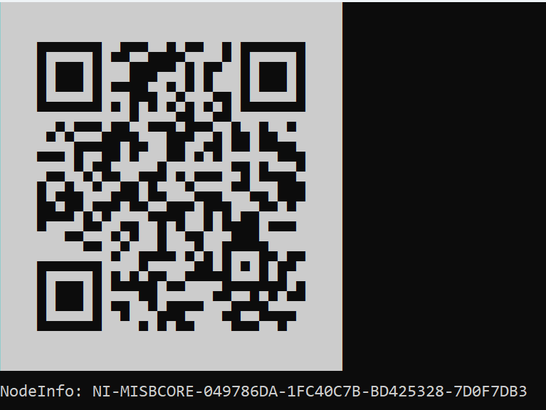

  

# MisbCore SDK

**MisbCore SDK** is a KLV / MISB metadata encoder / decoder (.Net Standard).

More [info](https://www.impleotv.com/content/misbcore/help/index.html).

## System Requirements
OS: Windows / Linux (not officially provided, but can be compiled for Linux).

## Installation

**MisbCore SDK** can be downloaded as a **zip** file that contains installer. Unzip the **MISBCoreSdk.zip** file and run the **MISBCoreSdk.exe**  

## Download link

|          | Version             | Download link                                                           | 
|:---------|:-------------------:|:------------------------------------------------------------------------|
| **MisbCore SDK** |  v1.4.0 | [MISBCoreSdk.zip](https://github.com/impleotv/misbcore-sdk-release/releases/latest/download/MISBCoreSdk.zip) | 

*Released on Sun, 19 Dec, 10:35 GMT+2*

## License

No license is needed for SDK evaluation - it will work in demo mode (with some restrictions).

**MisbCore SDK** is a node locked software, so you have to get a license (after purchasing the SDK) in order to lift demo restrictions. Please install it and fill an [online form](https://docs.google.com/forms/d/e/1FAIpQLSd_XW6bDsFce1G1cpds4gMQNlwNax0CvkWzcMbscxZ5rLaIbA/viewform), providing the ***Node Info*** string (IMPORTANT!!!) for the target machine.  
***Node Info*** string can be seen when you run the demo app, as shown below.

  

  

Please copy-paste *Node Info*, don't send an image...

You'll get back a **license** file and a **key**.

> For large quantities, please contact us for an **unlocked license**.
